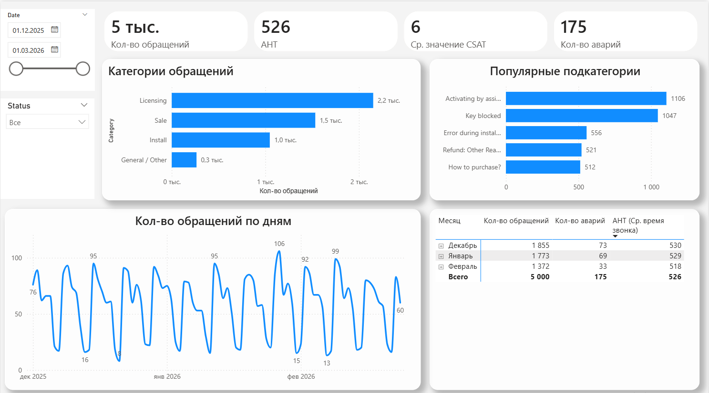
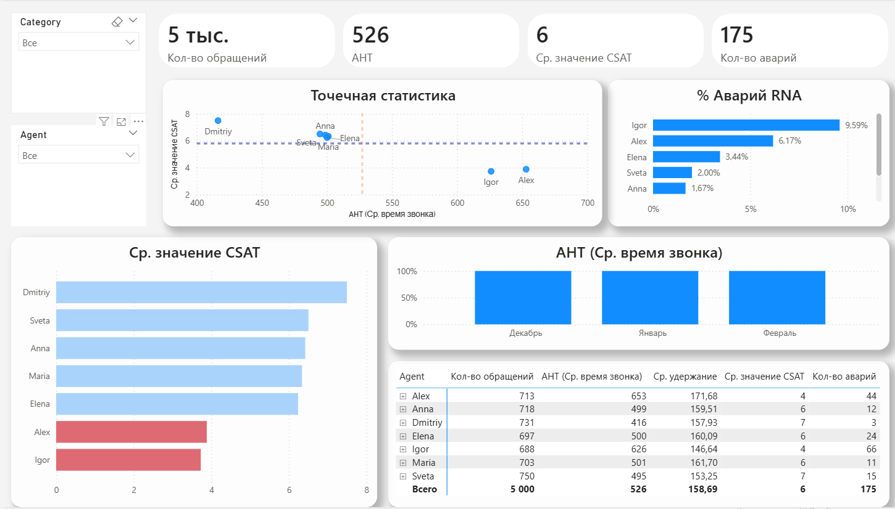

# Анализ эффективности линии технической поддержки

## 📌 О проекте
В данном проекте я проанализировал операционные метрики службы технической поддержки (на примере процессов крупной IT-компании). 

Цель проекта — выявить неэффективные паттерны в работе операторов (AHT), найти узкие места в категориях обращений и проанализировать динамику инцидентов.

**Важное примечание:** Данный дашборд построен на синтетических данных. Поскольку я не могу использовать реальные коммерческие данные (NDA), датасет был сгенерирован мной с помощью написания Python-скрипта совместно с ИИ. Имена агентов анонимизированы.

## 📊 Бизнес-задачи и полученные инсайты

**1. Мониторинг AHT (Average Handling Time) и CSAT (Customer Satisfaction)**
С помощью точечной диаграммы рассеяния были выделены агенты с аномальными показателями. Например, агент `Igor` показывает время обработки звонка значительно выше среднего при самом низком уровне удовлетворенности клиентов.

**2. Анализ категорий и подкатегорий**
Было выявлено, что категория "Licensing" (2.2 тыс.) и подкатегория "Key blocked" (1.1 тыс.) создают наибольшую нагрузку на линию. Оптимизация процедур активации или интерфейса в продукте может снизить нагрузку на саппорт на 20-30%.

**3. Дисциплина на линии: RNA (Ring No Answer)**
Анализ % Аварий (пропущенных/сброшенных вызовов на стороне оператора) показал, что у некоторых сотрудников этот показатель аномально высок. Это указывает на проблемы с дисциплиной (несвоевременный уход в статус "Перерыв") и напрямую влияет на Service Level всего отдела.

## 🛠 Стек технологий
* **Генерация данных:** Python (Pandas) + LLM Prompting
* **Визуализация / BI:** Power BI Desktop
